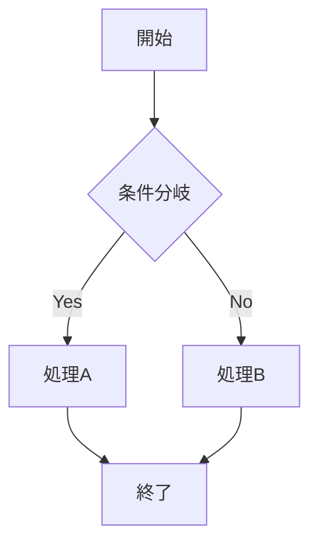

# Markdownサンプル

これはGUIのテスト用サンプルファイルです。

## 見出しの例

###見出しに問題あり
この見出しの後に空白がありません。

## コードブロック

```python
def hello():
    print("Hello, World!")
```

## Mermaid図表



## テーブル

| 項目 | 説明 |
|------|------|
| PySide6 | GUIフレームワーク |
| Markdown | マークアップ言語 |

## リスト

- アイテム1
- アイテム2
  - サブアイテム
- アイテム3

## TODO項目

TODO: これは検出されるはずです

## 引用

> これは引用ブロックです。
> 複数行にわたることもできます。

## リンク

[GitHub](https://github.com)

## 強調

**太字テキスト** と *イタリック* の例です。
